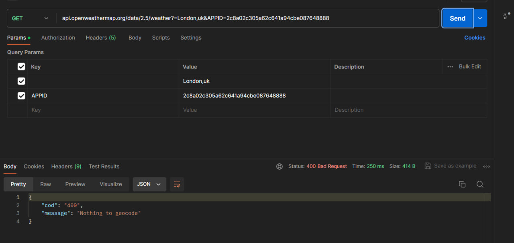
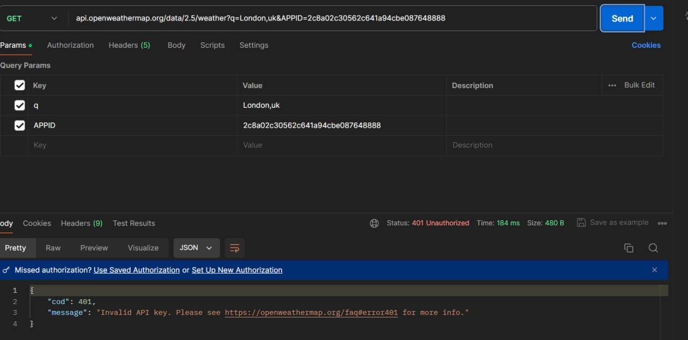
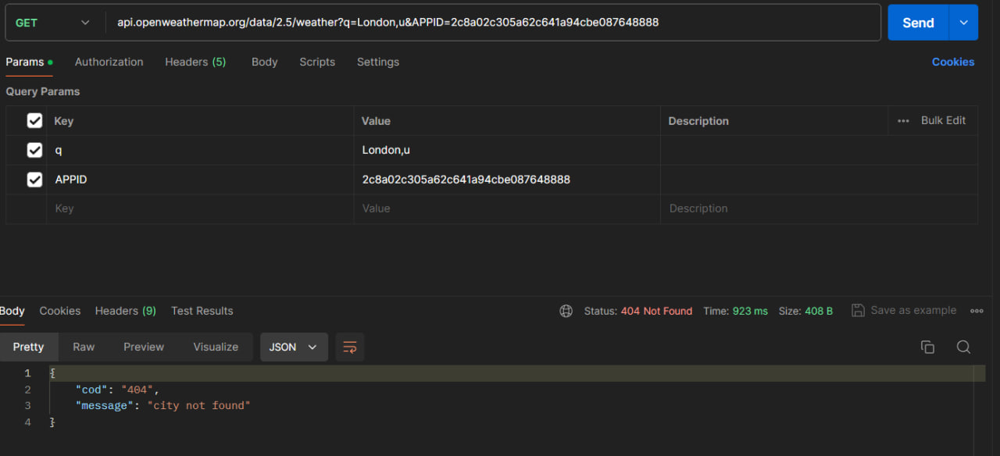
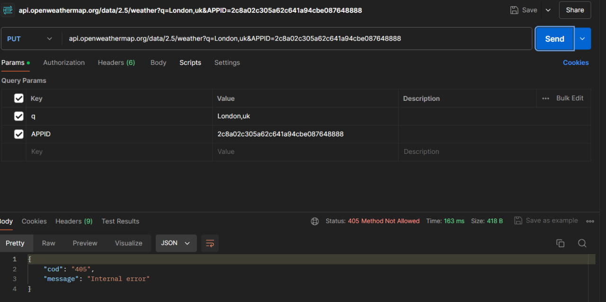

# Статусы 100-199
Мне не удалось получить коды состояния 100-199, потому что эти коды предназначены для промежуточных информационных ответов и не используются в конечных ответах API

# Статусы 200-299
### 200
Статус 200 указывает "OK". Это означает, что запрос был успешно выполнен, и сервер вернул запрашиваемый ресурс или информацию.

# Статусы 300-399
Не удалось получить статусы 3xx потому,что статусы 3xx в HTTP означают, что запрос был успешно выполнен, но для получения полного ответа необходимо выполнить дополнительные действия, такие как перенаправление на другую страницу или выбор одного из нескольких вариантов ответа. API OpenWeatherMap не предоставляет возможности для получения статусов 3xx.

Мне не удалось получить коды состояния 300-399, потому что эти коды предназначены для редиректов, а так как этот ресурс не даёт возможности выполнить такие действия как перенаправление к примеру, то и получить данные статусы не вышло.

# Статусы 400-499
### Статус 400
Статус 400 указывает на ошибку клиента и означает, что запрос был некорректным или не мог быть выполнен сервером из-за ошибки в запросе.(В данном случае я удалила один из параметров, но оставила его значение)

### Статус 401
Статус 401 указывает на ошибку авторизации. Он означает, что запрос требует аутентификации пользователя, и пользователь не был аутентифицирован или предоставленные учетные данные были неверными.(Здесь я указала неверный ключ)

### Статус 404
Статус 404 означает "Not Found" (не найдено). Это сообщение ошибка, которое сервер возвращает, когда он не может найти запрашиваемый ресурс по указанному URI. (В данной ситуации я изменила значение одного из параметров на неврное)

### Статус 405
Статус 405 указывает "Method Not Allowed" (метод не разрешен). Это означает, что метод запроса (например, GET, POST, PUT, DELETE) не поддерживается для запрашиваемого ресурса. (В этом случае я использовала метод PUT вместо GET)

# Статусы 500-599
Мне не удалось получить коды состояния 500-599, потому что эти коды указывают на внутренние ошибки сервера, и их вызов требует наличия проблем на сервере, которых в данном случае нет.

